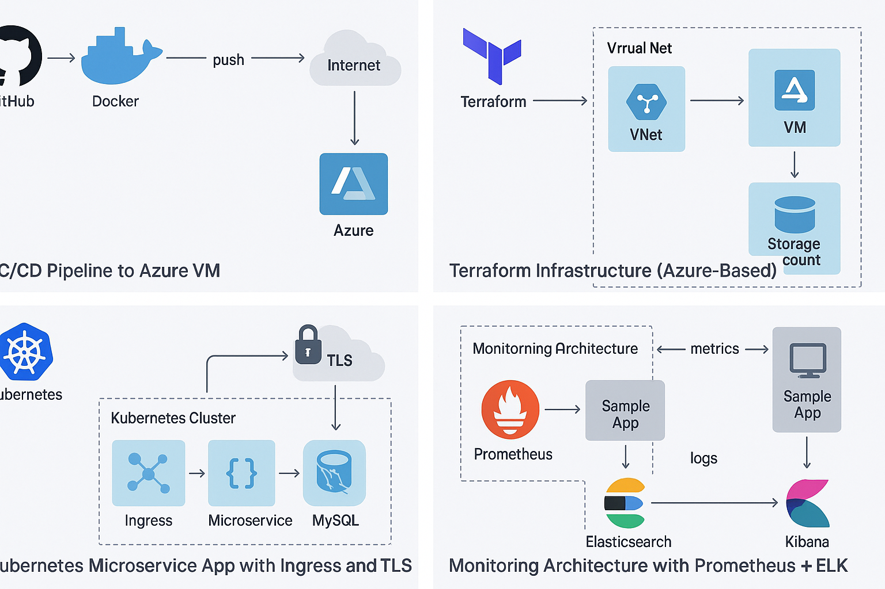

# Gabriel Mekuleyi | Cloud Solutions Architect & DevOps Engineer

Welcome to my GitHub portfolio! I am a Microsoft Certified Trainer, Cloud Solutions Architect, and DevOps Engineer with expertise in designing, deploying, and mentoring cloud-based solutions using Microsoft Azure, AWS, Docker, Kubernetes, and DevOps pipelines.

---

## 👨‍💻 About Me

- **Name:** Gabriel Mekuleyi  
- **Role:** Cloud Solutions Architect | DevOps Engineer | Microsoft Certified Trainer (MCT)  
- **Experience:** Azure, AWS, CI/CD, Kubernetes, Infrastructure as Code, and Technical Training  
- **Passion:** Empowering individuals and organizations to build secure and scalable cloud solutions  
- **Certifications:**  
  - Microsoft Certified: Azure Administrator  
  - Microsoft Certified: DevOps Engineer Expert  
  - Microsoft Certified Trainer (MCT)
  - Microsoft Certified: Solutions Architect 
  - AWS Certified Solutions Architect – Associate  

---

## 🔧 Skills

- **Cloud Platforms:** Azure, AWS  
- **DevOps Tools:** GitHub Actions, Jenkins, Docker, Kubernetes, Terraform, Helm  
- **Programming:** Bash, PowerShell, Python, JavaScript  
- **Infrastructure:** ARM/Bicep, Terraform, Azure CLI, AWS CLI  
- **Monitoring & Security:** Prometheus, Grafana, ELK Stack, Azure Monitor, Azure Security Center  
- **Training:** Microsoft 365, Azure Fundamentals, DevOps bootcamps  

---

## 🚀 Featured Projects

| Project | Description | Technologies |
|--------|-------------|--------------|
| [DevOps CI/CD Pipeline](https://github.com/G-devops-cpu/devops-cicd-pipeline) | Automates Docker builds and deployment to Azure using GitHub Actions. | Docker, GitHub Actions, Azure VM |
| [Terraform Azure Setup](https://github.com/G-DevOps-cpu/azure-terraform-iac.git) | Provisions Azure infrastructure with Terraform modules. | Terraform, Azure |
| [Kubernetes Java-MySQL App](https://github.com/G-DevOps-cpu/K8s-java-mysql.git) | Deploys a microservice with Kubernetes and Helm, with Ingress and TLS. | Kubernetes, Helm, MySQL, Spring Boot |
| [Monitoring Stack](https://github.com/G-DevOps-cpu/devops-monitoring-stack.git) | Centralized logging and monitoring setup. | Prometheus, Grafana, ELK |
| [Cloud Training Resources](https://github.com/G-devops-cp/cloud-training-resources) | Contains slides, labs, and exercises for students and interns. | Markdown, PowerPoint, Azure/AWS Labs |

## 🗂️ Architecture Diagrams

---

## 📬 Contact

- **Email:** mygodsent002@gmail.com  
- **LinkedIn:** [Gabriel Mekuleyi]((https://www.linkedin.com/in/gabriel-mekuleyi-8219911b2/))  
- **GitHub:** [G-devOps-cpu](https://github.com/G-devops-cpu)

---

> “Technology gives us tools, but passion fuels transformation.”

